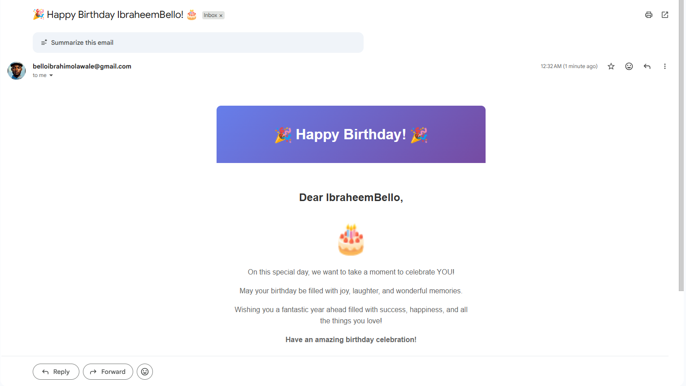

# 🎂 Birthday Reminder App

An automated birthday reminder system that collects customer birthdays and sends personalized email wishes automatically.

## 📧 Sample Birthday Email



_Beautiful, personalized birthday wishes sent automatically every day at 7:00 AM_

## 📋 Features

- Simple UI to collect username, email, and date of birth
- Email uniqueness validation
- Automated daily birthday checks at 7:00 AM
- Personalized birthday email with beautiful HTML template
- SQLite database (lightweight, no setup required)
- Cron job scheduler for automated tasks

## 🛠️ Technology Stack

- **Backend**: Node.js, Express.js
- **Database**: SQLite
- **Email**: Nodemailer (Gmail)
- **Scheduler**: node-cron
- **Validation**: express-validator

## 📁 Project Structure

```
birthday-reminder-app/
├── src/
│   ├── config/
│   │   ├── database.js         # SQLite database configuration
│   │   └── email.js            # Nodemailer email configuration
│   ├── controllers/
│   │   └── userController.js   # User registration and retrieval logic
│   ├── models/
│   │   └── user.js             # User data model with database queries
│   ├── routes/
│   │   └── userRoutes.js       # API routes with validation
│   ├── services/
│   │   ├── emailService.js     # Email sending functionality
│   │   └── birthdayService.js  # Birthday checking logic
│   ├── jobs/
│   │   └── birthdayCron.js     # Cron job configuration (7 AM daily)
│   ├── public/
│   │   ├── index.html          # Registration form UI
│   │   ├── styles.css          # Styling
│   │   └── script.js           # Frontend JavaScript
│   └── app.js                  # Express app configuration
├── server.js                    # Application entry point
├── .env                         # Environment variables (not in git)
├── .env.example                 # Environment variables template
├── package.json
└── README.md
```

## 🚀 Setup Instructions

### Prerequisites

- Node.js (v14 or higher)
- Gmail account with App Password enabled

### Step 1: Clone or Download

Download this project to your local machine.

### Step 2: Install Dependencies

```bash
npm install
```

### Step 3: Configure Gmail App Password

1. Go to your Google Account settings
2. Navigate to Security → 2-Step Verification
3. Scroll down to "App passwords"
4. Generate a new app password for "Mail"
5. Copy the 16-character password

### Step 4: Environment Variables

The `.env` file is already created with your credentials:

```env
PORT=3003
EMAIL_USER=belloibrahimolawale@gmail.com
EMAIL_PASS=ib65426444
DB_PATH=./database.sqlite
```

**For production deployment**, use the `.env.example` as a template and add your own credentials.

### Step 5: Start the Application

```bash
npm start
```

For development with auto-reload (requires nodemon):

```bash
npm install -g nodemon
npm run dev
```

## 🌐 Usage

1. **Access the application**: Open your browser and go to `http://localhost:3003`

2. **Register a birthday**:

   - Fill in the form with username, email, and date of birth
   - Click "Register"
   - You'll receive a confirmation message

3. **Automated birthday emails**:
   - The system checks for birthdays every day at 7:00 AM
   - Birthday celebrants automatically receive an email

## 🧪 Testing

### Test User Registration

```bash
# Using curl
curl -X POST http://localhost:3003/api/users \
  -H "Content-Type: application/json" \
  -d '{
    "username": "John Doe",
    "email": "john@example.com",
    "dateOfBirth": "1990-05-15"
  }'
```

Expected response:

```json
{
  "success": true,
  "message": "User registered successfully",
  "data": {
    "id": 1,
    "username": "John Doe",
    "email": "john@example.com",
    "dateOfBirth": "1990-05-15"
  }
}
```

### Test Email Uniqueness

Try registering the same email twice - you should get an error:

```json
{
  "success": false,
  "message": "Email already exists"
}
```

### Test Birthday Email (Manual Trigger)

To test the birthday email functionality immediately:

1. Register a user with **today's date** as their birthday (use current month and day)
2. Open `server.js` and temporarily add this line after `startBirthdayCron();`:

```javascript
const { checkAndSendBirthdayEmails } = require("./src/jobs/birthdayCron");
checkAndSendBirthdayEmails(); // Manual trigger for testing
```

3. Restart the server
4. Check the registered email inbox for the birthday email

### View All Users

```bash
curl http://localhost:3003/api/users
```

## 📧 API Endpoints

### POST /api/users

Register a new user with birthday information.

**Request Body:**

```json
{
  "username": "string (2-50 chars)",
  "email": "string (valid email)",
  "dateOfBirth": "string (YYYY-MM-DD format)"
}
```

**Response (Success):**

```json
{
  "success": true,
  "message": "User registered successfully",
  "data": {
    "id": 1,
    "username": "John Doe",
    "email": "john@example.com",
    "dateOfBirth": "1990-05-15"
  }
}
```

**Response (Error - Duplicate Email):**

```json
{
  "success": false,
  "message": "Email already exists"
}
```

### GET /api/users

Retrieve all registered users (for verification purposes).

**Response:**

```json
{
  "success": true,
  "count": 2,
  "users": [
    {
      "id": 1,
      "username": "John Doe",
      "email": "john@example.com",
      "date_of_birth": "1990-05-15",
      "created_at": "2024-01-15 10:30:00"
    }
  ]
}
```

## 🚀 Deployment (Render.com)

### Step 1: Prepare for Deployment

1. Initialize git repository:

```bash
git init
git add .
git commit -m "Initial commit"
```

2. Push to GitHub:

```bash
git remote add origin your-github-repo-url
git push -u origin main
```

### Step 2: Deploy to Render

1. Go to [Render.com](https://render.com) and sign up/login
2. Click "New +" → "Web Service"
3. Connect your GitHub repository
4. Configure:

   - **Name**: birthday-reminder-app
   - **Environment**: Node
   - **Build Command**: `npm install`
   - **Start Command**: `npm start`
   - **Plan**: Free

5. Add Environment Variables:

   - `EMAIL_USER`: your-gmail@gmail.com
   - `EMAIL_PASS`: your-app-password
   - `PORT`: 3003 (Render will override this)
   - `DB_PATH`: ./database.sqlite

6. Click "Create Web Service"

### Step 3: Verify Deployment

- Access your app at: `https://your-app-name.onrender.com`
- Register a test user
- Check logs to verify cron job is running

**Note**: Render's free tier may sleep after inactivity. The cron job runs when the service is active.

## ⚙️ Cron Job Configuration

The birthday check runs **daily at 7:00 AM** server time.

Cron expression: `0 7 * * *`

Format: `minute hour day month day-of-week`

To change the schedule, edit [src/jobs/birthdayCron.js:8](src/jobs/birthdayCron.js#L8):

```javascript
const cronSchedule = "0 7 * * *"; // Change this
```

Examples:

- `0 9 * * *` - 9:00 AM daily
- `0 8 * * 1` - 8:00 AM every Monday
- `0 */6 * * *` - Every 6 hours

## 🐛 Troubleshooting

### Emails not sending

1. **Check Gmail credentials**: Verify EMAIL_USER and EMAIL_PASS in .env
2. **App Password**: Ensure you're using Gmail App Password, not regular password
3. **2-Factor Authentication**: Must be enabled to generate app passwords
4. **Less secure apps**: Not needed if using App Passwords
5. **Check logs**: Look for error messages in console

### Database errors

1. **Permissions**: Ensure write permissions in the project directory
2. **File path**: Check DB_PATH in .env points to correct location
3. **Reset database**: Delete `database.sqlite` file to start fresh

### Cron not running

1. **Check logs**: Server should log "Birthday cron job scheduled to run daily at 7:00 AM"
2. **Server time**: Cron uses server timezone
3. **Manual test**: Temporarily change cron to `* * * * *` (runs every minute) for testing

## 📝 License

ISC

## 👨‍💻 Support

For issues or questions, check the application logs for error messages.
